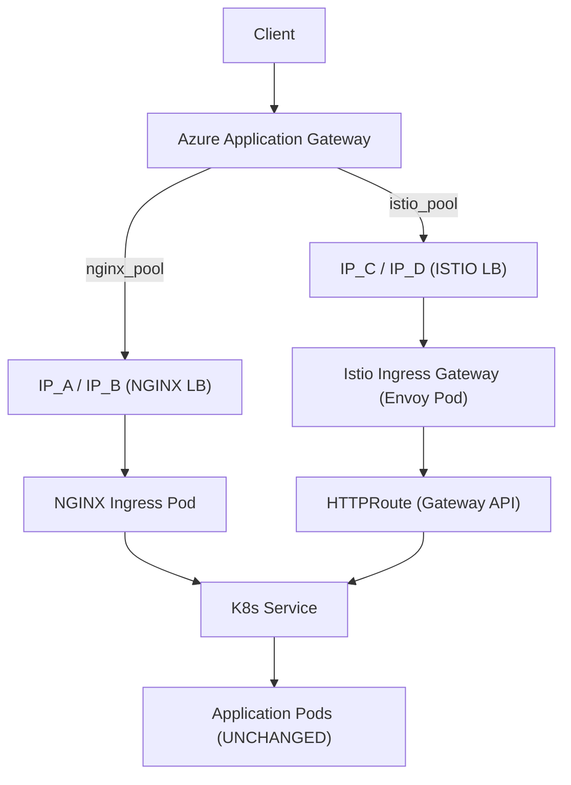
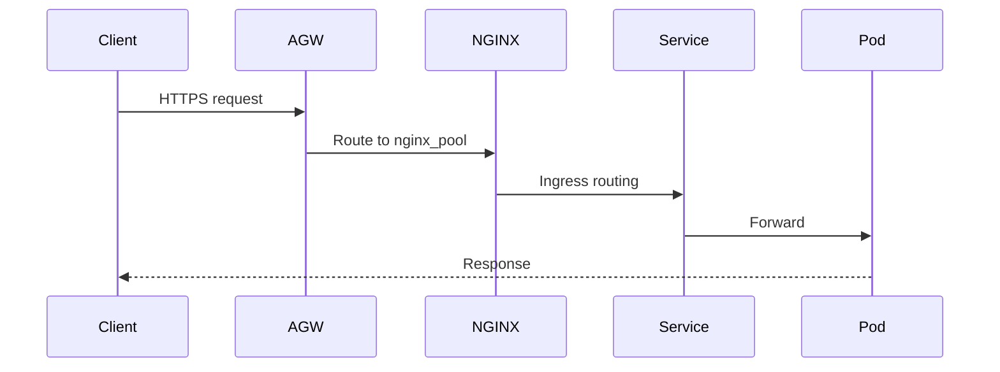
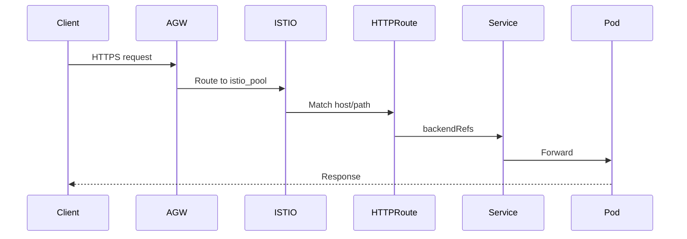

# NGINX Ingress ➜ Istio Gateway API Migration (Zero-Downtime)
# การ Migrate จาก NGINX Ingress ไป Istio Gateway API (Zero-Downtime)

Enterprise-grade migration runbook for moving an application from
**NGINX Ingress Controller** to **Istio Gateway API (gateway.networking.k8s.io)**
on AKS while keeping **Azure Application Gateway** as the primary entry (As-Is).

--------------------------------------------------------------------------------

# 🎯 Objectives (Critical Requirements)

1) ✅ No Downtime during switch  
2) ✅ Rollback must be immediate and safe  
3) ✅ No Microservice / Application redeploy required  
4) ✅ Minimal regression testing (critical flows only)

--------------------------------------------------------------------------------

# 🏗 Architecture Overview (Aligned with Attached Diagram)

Layer 1: Azure Application Gateway (Existing – unchanged)  
Layer 2: AKS Service type=LoadBalancer  
Layer 3: Ingress Data Plane  
   - Existing: nginx ingress controller (IP_A / IP_B)  
   - New: istio ingress gateway (IP_C / IP_D)  
Layer 4: Application / Microservices (UNCHANGED)

Key Constraint:
Azure Application Gateway DOES NOT support weighted traffic split (90/10).
Migration strategy = Blue/Green backend pool switch.

--------------------------------------------------------------------------------

# 🧠 Key Migration Strategy

We run **NGINX and Istio ingress in parallel (dual-run)**.

1. Deploy Istio Gateway API fully.
2. Validate via direct IP_C / IP_D (shadow test).
3. Prepare new AppGW backend pool (istio_pool).
4. Perform single backend switch.
5. Keep nginx alive for rollback.
6. Decommission nginx only after stabilization.

This guarantees:
- No downtime
- Fast rollback
- No redeploy of microservices

--------------------------------------------------------------------------------

# 📊 Mermaid – Architecture (Dual Run)



--------------------------------------------------------------------------------

# 🔄 Flow Before Switch (As-Is)



--------------------------------------------------------------------------------

# 🔄 Flow After Switch (To-Be)



--------------------------------------------------------------------------------

# 🚀 Migration Phases (Zero-Downtime Runbook)

## Phase 0 – Prepare Istio (No Production Impact)

- Deploy istiod (control plane)
- Deploy istio ingress gateway
- Expose Service type=LoadBalancer → IP_C / IP_D
- Create GatewayClass (platform)
- Create shared Gateway (platform)
- App deploy HTTPRoute (NO traffic yet)
- Validate:
  - Accepted=True
  - ResolvedRefs=True

No production traffic affected.

---

## Phase 1 – Shadow Validation (Minimal Regression)

Test via direct IP_C/IP_D with Host header:

Example:
curl -H "Host: api.bank.com" https://IP_C/v1/app

Validate:
- Health endpoint
- 3–5 critical APIs
- Auth flow
- Header integrity
- Latency sanity

Production still on nginx.

---

## Phase 2 – Prepare Azure App Gateway

- Create backend pool: istio_pool
- Add IP_C and IP_D
- Configure health probe (use real readiness endpoint)
- Enable connection draining (30–120s)
- Confirm backend Healthy

---

## Phase 3 – Production Cutover

Switch backend pool:

nginx_pool → istio_pool

Monitor immediately:
- 5xx rate
- Latency p95/p99
- Backend health
- Istio ingress CPU/memory

NGINX remains running (do NOT delete).

---

## Phase 4 – Stabilization Window

Run on Istio 24–72 hours.
Keep nginx as fallback.

---

## 🔙 Rollback Plan (Instant)

Switch backend pool:

istio_pool → nginx_pool

Estimated RTO: 1–5 minutes.

No redeploy required.
No DNS change required.
No service restart required.

--------------------------------------------------------------------------------

# ⚠ Risk Assessment

| Risk | Impact | Mitigation |
|------|--------|------------|
| TLS termination mismatch | High | Keep same TLS mode as As-Is |
| Host/path mismatch | High | Mirror nginx rules exactly |
| Health probe misconfig | High | Use actual readiness endpoint |
| Header mismatch | Medium | Preserve X-Forwarded headers |
| Capacity regression | Medium | Configure HPA + resource limits |
| Long-lived connection drop | Medium | Enable connection draining |

--------------------------------------------------------------------------------

# 📈 Impact Analysis

| Area | Change | Impact |
|------|--------|--------|
| Microservices | None | None |
| Kubernetes Services | None | None |
| Ingress Layer | NGINX → Istio | Medium |
| App Gateway | Backend switch only | Low |
| Rollback | Immediate via AppGW | Low |

--------------------------------------------------------------------------------

# ⏱ Rollback Time Objective (RTO)

| Scenario | Target RTO |
|----------|-----------|
| Routing issue | 1–5 min |
| 5xx spike | 1–5 min |
| TLS issue | 5–10 min |
| Capacity issue | 5–10 min |

--------------------------------------------------------------------------------

# 🧾 Production Change Window Checklist

## Before Change
- [ ] Istio ingress stable
- [ ] HTTPRoute Accepted=True
- [ ] istio_pool Healthy in AppGW
- [ ] Monitoring ready
- [ ] Rollback owner confirmed
- [ ] Change record approved

## During Change
- [ ] Switch backend pool
- [ ] Monitor 5xx and latency 15–30 min
- [ ] Validate critical APIs

## After Change
- [ ] Confirm baseline metrics
- [ ] Keep nginx alive
- [ ] Document outcome

--------------------------------------------------------------------------------

# 🧩 Example YAML

## Gateway

```yaml
apiVersion: gateway.networking.k8s.io/v1
kind: Gateway
metadata:
  name: shared-istio-gw
  namespace: istio-system
spec:
  gatewayClassName: istio
  listeners:
    - name: https
      port: 443
      protocol: HTTPS
      hostname: api.bank.com
      tls:
        mode: Terminate
        certificateRefs:
          - kind: Secret
            name: api-bank-com-tls
```

## HTTPRoute

```yaml
apiVersion: gateway.networking.k8s.io/v1
kind: HTTPRoute
metadata:
  name: app-route
  namespace: ns-app
spec:
  parentRefs:
    - name: shared-istio-gw
      namespace: istio-system
  hostnames:
    - api.bank.com
  rules:
    - matches:
        - path:
            type: PathPrefix
            value: /v1/app
      backendRefs:
        - name: app-service
          port: 80
```

--------------------------------------------------------------------------------

# ✅ What Does NOT Change

- No microservice redeploy
- No Pod restart
- No Service change
- No Database change
- No internal service discovery change

Only routing layer changes.

--------------------------------------------------------------------------------

# 🏁 Final Summary

1) Deploy Istio ingress gateway
2) Deploy Gateway + HTTPRoute
3) Validate via IP_C/IP_D
4) Add istio_pool to AppGW
5) Switch backend (zero downtime)
6) Rollback instantly if needed
7) Decommission nginx after stabilization

This migration guarantees:
- No downtime
- Safe rollback
- No application redeploy
